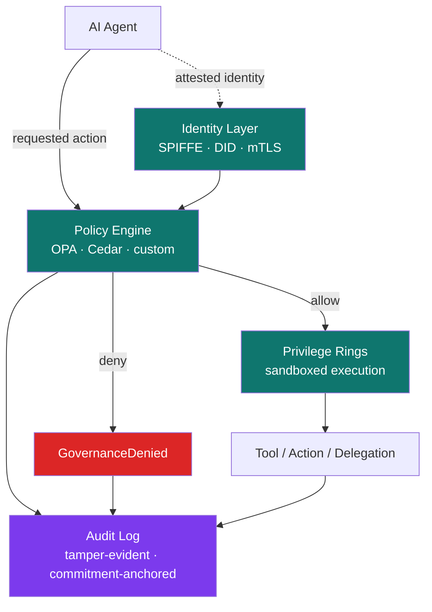

<div align="center">

# Agent Governance Spine

**The protocol-layer substrate where AI agents are governed deterministically — not asked to behave. Policy enforcement, per-agent identity, and tamper-evident audit applied to every agent action BEFORE the model's intent reaches the wire. Production patterns for agent systems that must survive an audit, a regulator, or a post-mortem.**

[](LICENSE-CC-BY-4.0)
[](LICENSE-MIT)
[](SPEC.md)
[](#catalog)

</div>

---

> **Draft:** Drew Mattie · SaaSquach AI Labs (a division of Charles & Roe Inc.) · 2026

# What this is

AGS is a pattern for the layer that **governs** AI agents — the protocol-layer substrate where every agent action passes through deterministic policy enforcement, carries verifiable per-agent identity, and lands in a tamper-evident audit log. Whether one agent or one hundred, whether one tool or one thousand: every action goes through the spine before it reaches anything that can change state in the world.

Most production agent systems today rely on prompt-level safety as their primary control surface. *"Please don't drop the table."* *"Only send emails to verified recipients."* *"Refuse unauthorized operations."* This is a polite request to a stochastic system.

The empirical record is unambiguous. On JailbreakBench (Chao et al., NeurIPS 2024), the standard open robustness benchmark, adaptive attacks reach **near-100% attack success rates** against frontier safety-aligned models. Andriushchenko et al. (ICLR 2025) report 100% ASR on GPT-4, GPT-3.5, Claude 3, Llama-3, Gemma-7B, and a dozen other frontier models using simple prompt-only attacks. Microsoft's own AI Red Team, after red-teaming 100 generative AI products, concludes that *"AI red teaming is a continuous process that should adapt to the rapidly evolving risk landscape"* — model-layer defenses are probabilistic by construction.

AGS does not try to win that fight inside the prompt. Every tool call, message send, and delegation is intercepted in deterministic application code **before** the model's intent reaches the wire. Actions the spine denies are not "unlikely." They are **structurally impossible**.

That is the difference between asking an agent to behave and making it incapable of misbehaving.

# Why it exists

Four failure modes recur across production agent deployments. AGS addresses them by enforcing structurally rather than asking nicely.

1. **Prompt-layer trust collapse.** Relying on the model's compliance instead of deterministic policy. The empirical case is closed: prompt-layer defenses leak double-digit residual attack success rate on frontier models.
2. **Identity blur.** In a multi-agent system, five agents might share a single API key. When something goes wrong, *"an agent did it"* is not an incident response. You cannot improve what you cannot attribute.
3. **Audit gap.** No tamper-evident record of what policy was active, what the agent requested, and why it was allowed or denied. Auditors cannot certify. SOC 2 / ISO 27001 / regulators cannot sign off.
4. **Policy drift.** Policy lives in prose, in tribal knowledge, or in stale config files. Not in versioned, lintable, testable code. The actual behavior of the system diverges from what was approved, and no one notices until an incident.

AGS is the implementation pattern that addresses all four — by enforcing policy as code, anchoring identity per agent, recording every decision tamper-evidently, and treating governance as protocol-layer infrastructure rather than prompt-layer hope.

# Architecture



Every arrow into a tool, every message between agents, every delegation: routed through the spine. Allowed actions execute in scoped sandboxes. Denied actions never execute. Every decision is recorded.

# Where AGS fits in the catalog

AGS is the **fifth specification** in the SaaSquach AI Labs architectural catalog. It sits as a peer governance-substrate alongside the four data/coordination layers:

```
┌──────────────────────────────────────────────────────────┐
│ User · Product · Operator                                 │
└────────────────────┬─────────────────────────────────────┘
                     ↓
┌──────────────────────────────────────────────────────────┐
│ ACS — Adversarial Coordination Spine                      │  ← multi-agent
└──────┬───────────────────────────────────┬───────────────┘
       ↓                                   ↓
┌──────────────┐  ┌─────────────────┐  ┌──────────────┐
│ PDS          │  │ ESF             │  │ CRI          │
│ tool         │  │ external signal │  │ composite    │
│ discipline   │  │ fabric          │  │ scoring      │
└──────┬───────┘  └──────┬──────────┘  └──────┬───────┘
       ↓                 ↓                    ↓
┌──────────────────────────────────────────────────────────┐
│ AGS — Agent Governance Spine                              │  ← THIS spec
│ deterministic policy · identity · tamper-evident audit   │
└──────────────────────────┬───────────────────────────────┘
                           ↓
┌──────────────────────────────────────────────────────────┐
│ Model Context Protocol (MCP)                              │
└──────────────────────────┬───────────────────────────────┘
                           ↓
┌──────────────────────────────────────────────────────────┐
│ Backends · External APIs · Data Stores                    │
└──────────────────────────────────────────────────────────┘
```

PDS, ACS, ESF, CRI describe *how data and coordination flow through* an agent system. AGS describes *what is allowed and recorded*. Every action that any of those four layers initiate passes through the AGS spine before it can change anything in the world.

# The 10 principles

| # | Principle | The shift |
|---|---|---|
| 01 | **Deterministic policy enforcement, not prompt-level safety** | Every action is denied or allowed in application code BEFORE the model's intent reaches the wire. Not "the model said no." Not "the system prompt warns against it." Structurally impossible to execute. |
| 02 | **Identity per agent, not per session** | Every agent has a stable cryptographic identity (SPIFFE / DID / mTLS). "An agent did it" is never an acceptable answer. |
| 03 | **Tamper-evident audit log** | Every decision (allow, deny, escalate) is recorded in an append-only, commitment-anchored audit log. SOC 2 / ISO 27001 / regulator-defensible. |
| 04 | **Policy as code, not as prose** | YAML / OPA / Cedar / equivalent. Versioned, lintable, testable, reviewable. Never in the system prompt; never in tribal knowledge. |
| 05 | **Privilege rings, not flat permissions** | Agent execution is sandboxed in tiered privilege rings. Low-trust agents cannot reach high-trust resources by accident or by design. |
| 06 | **Kill switch + SLO monitoring + chaos testing** | Every deployed agent is monitored against an SLO and reachable by a human-operated kill switch. Chaos testing of the governance layer itself, not just the agents. |
| 07 | **Tool poisoning detection + drift monitoring** | The tool supply chain is itself a threat surface. Hidden instructions, typosquatting, drift between authored manifest and runtime behavior all detected at the spine. |
| 08 | **Shadow agent discovery** | Unregistered agents are a real production risk. The spine includes active discovery for processes, configs, and repos. |
| 09 | **Trust scoring for plugin marketplaces** | Composite agent-trust score at the marketplace level. Different from CRI's customer-decision-level scoring — this is agent-level reputation. |
| 10 | **Governance-aware training** | If you control post-training, the model is trained with violation penalties (RL-style). Agents that learn to respect the policy substrate are cheaper to govern at runtime. |

Full discussion of each principle, with problems, patterns, and implementation notes, lives in [SPEC.md](SPEC.md).

# The five-failure attribution extended to six

The four-spec catalog (PDS / ACS / ESF / CRI) produces the **five-way failure attribution dictionary**: PDS-data / ESF-data / ACS-planner / ACS-evaluator / CRI-scoring. AGS extends it to **six**:

| Attribution | Owned by | "Failure looked like..." |
|---|---|---|
| Bad customer data | PDS | Wrong supplier ID, stale internal cache, missing record |
| Bad world data | ESF | Expired signal, mis-tagged advisory, broken adapter |
| Bad reasoning | ACS Planner | Plan unsupported by signals |
| Bad evaluation | ACS Evaluator | Rubber-stamped contract violation |
| Bad scoring | CRI | Confident score on insufficient inputs |
| **Bad governance** | **AGS** | **Policy gap (action wasn't denied because no rule covered it), identity ambiguity (we know an agent did it but not which), audit gap (no record exists), or policy drift (deployed policy differs from approved policy)** |

This six-attribution dictionary is the meta-architectural contribution of the full SaaSquach AI Labs catalog. Build, measure, and own each surface separately.

# Industry context — convergence on the same pattern

AGS is not a novel invention. It is a formalization of a pattern that policy-engine vendors, identity-protocol authors, and major-vendor governance platforms have independently converged on. The pattern crystallized as agent deployments crossed the threshold where adversarial robustness became a customer-blocking concern. AGS synthesizes that convergence into a single referenceable specification.

## Foundational policy + identity layers (the building blocks AGS sits above)

**Open Policy Agent (CNCF graduated).** The canonical general-purpose policy engine: *"The Open Policy Agent (OPA, pronounced 'oh-pa') is an open source, general-purpose policy engine that unifies policy enforcement across the stack."* [Source](https://www.openpolicyagent.org/docs/)

**AWS Cedar Policy Language.** The canonical language for verified analyzable authorization: *"Cedar is a language for writing authorization policies and making authorization decisions based on those policies."* Peer-reviewed (Cedar paper, arXiv:2403.04651). [Source](https://docs.cedarpolicy.com/)

**Permit.io.** Commercial policy-as-code platform with explicit agent-governance framing: *"Permit.io unifies policy, delegation, approvals, trust, and audit into one action-time policy fabric — for humans, services, and AI agents."* [Source](https://www.permit.io/)

**SPIFFE (CNCF).** Workload identity standard: *"Systems that adopt SPIFFE can easily and reliably mutually authenticate wherever they are running."* [Source](https://spiffe.io/docs/latest/spiffe-about/overview/)

**W3C Decentralized Identifiers (DIDs) v1.0.** W3C Recommendation: *"DIDs are designed so that they may be decoupled from centralized registries, identity providers, and certificate authorities."* [Source](https://www.w3.org/TR/did-core/)

## Productized governance kernels (proof that the pattern is shippable)

**Microsoft — Agent Governance Toolkit.** Microsoft's MIT-licensed multi-language governance kernel for autonomous AI agents. Covers OWASP Agentic Top 10 10/10. Productizes deterministic policy enforcement, SPIFFE/DID/mTLS identity, tamper-evident audit: *"Actions the AGT kernel denies are not 'unlikely.' They are structurally impossible."* Microsoft anchors the empirical case in JailbreakBench and concludes that prompt-layer defenses leak double-digit residual ASR. [Source](https://github.com/microsoft/agent-governance-toolkit)

## Empirical case for deterministic enforcement (why prompt-level is insufficient)

**JailbreakBench (Chao et al., NeurIPS 2024).** Standard open robustness benchmark: *"Jailbreak attacks cause large language models (LLMs) to generate harmful, unethical, or otherwise objectionable content."* Adaptive attacks against frontier safety-aligned models reach near-100% attack success rates. [arXiv:2404.01318](https://arxiv.org/abs/2404.01318)

**Andriushchenko, Croce, Flammarion (ICLR 2025).** Simple adaptive attacks against leading safety-aligned LLMs: *"we achieve 100% attack success rate... on Vicuna-13B, Mistral-7B, Phi-3-Mini, Nemotron-4-340B, Llama-2-Chat-7B/13B/70B, Llama-3-Instruct-8B, Gemma-7B, GPT-3.5, GPT-4o."* 100% on Claude via transfer or prefilling. [arXiv:2404.02151](https://arxiv.org/abs/2404.02151)

**Microsoft AI Red Team (Jan 2025).** After red-teaming 100 generative AI products: *"AI red teaming is a continuous process that should adapt to the rapidly evolving risk landscape."* Model-layer defenses are probabilistic by construction. [Source](https://www.microsoft.com/en-us/security/blog/2025/01/13/3-takeaways-from-red-teaming-100-generative-ai-products/)

## OWASP risk taxonomy

**OWASP LLM06:2025 — Excessive Agency.** The canonical OWASP risk taxonomy entry for agent action-space governance: *"An LLM-based system is often granted a degree of agency by its developer — the ability to call functions or interface with other systems."* [Source](https://genai.owasp.org/llmrisk/llm062025-excessive-agency/) · Companion: [OWASP Agentic AI Threats and Mitigations](https://genai.owasp.org/resource/agentic-ai-threats-and-mitigations/) (Feb 2025).

## What AGS contributes

The sources above document INDIVIDUAL implementations and isolated primitives. AGS contributes:

1. A unified set of **10 principles** mapped to four documented failure modes
2. **Target SLAs** for production governance readiness
3. An **8-step build sequence** from skeleton to first reference deployment
4. **Anti-patterns** to avoid
5. A **portable, citable specification** under CC BY 4.0 — adopt, adapt, build commercial products on top, with attribution
6. **Explicit composition with PDS, ACS, ESF, and CRI** — the six-way failure attribution dictionary the five-spec catalog enables

If your team is independently converging on this pattern (as Microsoft, OPA, Cedar, SPIFFE, Permit.io and others already have), AGS gives you a vocabulary, a checklist, and a published artifact you can hand to your regulators / auditors / customers.

# What good looks like (target SLAs)

| Metric | Target | Why it matters |
|---|---|---|
| Actions executed without policy evaluation | 0 | Non-negotiable — every action goes through the spine |
| Actions executed without verifiable agent identity | 0 | "An agent did it" is never acceptable |
| Audit log completeness (every decision recorded) | 100% | SOC 2 / ISO 27001 prerequisite |
| Audit log tamper-evidence | Cryptographic anchoring | Hash chain / Merkle proof / equivalent |
| Policy evaluation p95 latency | < 5 ms | Spine cannot be the latency bottleneck |
| Policy as code coverage | 100% of in-scope actions | If a tool isn't covered by policy, it shouldn't be reachable |
| Shadow agent discovery rate | All processes scanned weekly | Unregistered agents are a real production risk |
| Policy lint pass rate before deploy | 100% | No untested policy reaches production |
| Adversarial penetration test (red team) | < 1% structural ASR | Acknowledged: this is < model-layer ASR by an order of magnitude |
| Time from policy decision to audit-log record | < 1 s | Audit lag is an attack window |

# Reference build sequence

AGS is built in sequence — skeleton through to first production reference deployment. Each step depends on the previous one. Pace varies by team and tooling; the sequence does not.

| Step | Deliverable |
|---|---|
| 1 | Policy engine + first deterministic deny — one tool wrapped, one policy rule, one allow / deny path |
| 2 | Audit log — append-only, structured, written on every decision (allow + deny) |
| 3 | Agent identity — every action carries a verifiable agent-ID; cross-tenant identity isolation enforced |
| 4 | Tamper-evidence — commitment anchoring (hash chain / Merkle / signed batches) on the audit log |
| 5 | Privilege rings — sandboxed execution tiered by agent trust level |
| 6 | Kill switch + SLO monitoring — humans can stop a runaway agent in seconds; SLO breaches trigger alerts |
| 7 | Tool poisoning detection + shadow agent discovery — supply-chain governance |
| 8 | Spec / one-pager / case study |

See [SPEC.md](SPEC.md#5-build-sequence) for details.

# Who this is for

- **CTOs / CISOs / CIOs** deploying autonomous agents to production — when prompt-level safety stops being defensible
- **GRC / compliance / audit teams** that need to certify agent systems against SOC 2 / ISO 27001 / regulator standards
- **Enterprise platform teams** evaluating AGT, OPA, Cedar, Permit.io, SPIFFE — this gives you the vocabulary to ask the right questions
- **AI engineers** building agent systems that must survive a real adversarial environment
- **Buyers** of AI vendors — the questions to ask vendors who claim governance ("Do you enforce deterministically? Where is agent identity attested? Is the audit log tamper-evident? Where does the policy live?")

# What this is not

- Not a library you install. It's an architectural pattern with reference SLAs and examples.
- Not a replacement for any specific governance product (OPA, Cedar, Permit.io, AGT). The pattern is what they all implement; AGS describes the pattern.
- Not a substitute for red-teaming. Even with AGS, you red-team continuously. AGS narrows the attack surface from "prompt-layer ASR" (~100% on frontier models) to "structural ASR" (the policy + identity surface), which is orders of magnitude smaller.
- Not a substitute for PDS / ACS / ESF / CRI. AGS is the protocol-layer substrate that governs whatever those four describe.

# Use it with Claude (or any AI coding agent)

AGS ships with a [Claude Code skill](dist/skills/ags/SKILL.md) that turns the spec into an active architectural consultant inside your AI coding session. Install:

```bash
mkdir -p ~/.claude/skills/ags
curl -fsSL https://raw.githubusercontent.com/drewmattie-code/Agent-Governance-Spine/main/dist/skills/ags/SKILL.md \
  -o ~/.claude/skills/ags/SKILL.md
```

After install, the skill auto-activates whenever you ask Claude about agent governance, policy enforcement, identity for agents, audit logs for AI systems, OWASP agentic risks, or any of the other triggering contexts. It diagnoses which of the four documented failure modes you're hitting and recommends which of the 10 principles to apply.

# Examples

The [`examples/`](examples/) directory has concrete artifacts:

- [`policy-yaml.example.md`](examples/policy-yaml.example.md) — what a production-grade policy file looks like (allow/deny/require-approval rules with conditions)
- [`audit-record.example.json`](examples/audit-record.example.json) — what an AGS audit-log entry looks like, with commitment anchoring
- [`privilege-rings.md`](examples/privilege-rings.md) — four-ring sandboxing model worked through for a typical agent fleet

# Citing this work

If you reference AGS in a paper, talk, blog post, or vendor architecture, please cite it. A machine-readable citation file is in [CITATION.cff](CITATION.cff). Suggested citation:

> Mattie, D. (2026). *Agent Governance Spine: An architectural pattern for deterministic policy enforcement, per-agent identity, and tamper-evident audit for autonomous AI agents.* https://github.com/drewmattie-code/Agent-Governance-Spine

# Contributing

Issues, examples, implementation reports, and policy patterns welcome. See [CONTRIBUTING.md](CONTRIBUTING.md).

# License

- **Spec, documentation, diagrams** — [Creative Commons Attribution 4.0 (CC BY 4.0)](LICENSE-CC-BY-4.0). Use it, adapt it, build commercial products on top — credit the source.
- **Code samples and examples** — [MIT](LICENSE-MIT).

# Catalog

AGS is the fifth specification in the SaaSquach AI Labs architectural catalog:

- **[PDS — Progressive Discovery Spine](https://github.com/drewmattie-code/Progressive-Discovery-Spine)** — single-agent tool discipline
- **[ACS — Adversarial Coordination Spine](https://github.com/drewmattie-code/Adversarial-Coordination-Spine)** — multi-agent coordination
- **[ESF — External Signal Fabric](https://github.com/drewmattie-code/External-Signal-Fabric)** — external-world signal substrate
- **[CRI — Composite Risk Index](https://github.com/drewmattie-code/Composite-Risk-Index)** — composite scoring *(private)*
- **AGS — Agent Governance Spine** *(this spec)* — protocol-layer governance

Together they form the six-way failure attribution dictionary (bad customer data / bad world data / bad reasoning / bad evaluation / bad scoring / bad governance) documented above. Each spec plants a flag at a different layer of the agent-architecture stack.

# Author

[Drew Mattie](https://www.linkedin.com/in/drew-mattie-88084826/) · SaaSquach AI Labs (a division of Charles & Roe Inc.) · 2026
